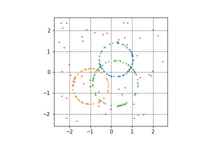
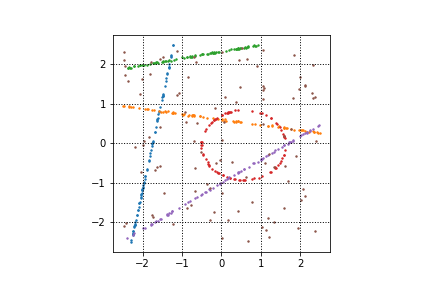

# sydraw

[](https://pypi.org/project/sydraw)
[](https://pypi.org/project/sydraw)
[](https://pypistats.org/packages/sydraw)

sydraw (Synthetic Data Library) is a python library that helps you create synthetic 2D point clouds for single/multi-model single/multi-class tasks.  
You'll be able to fix a set of hyperparameters for each class of models you are interested in generating.  
Models are saved in a .mat file format.  
Have a look at some samples:

|              Single Class - Single Model               |  Single Class -  Multi Model                        |  Multi Class - Multi Model                        |   
|:------------------------------------------------------:|:---------------------------------------------------:|:-------------------------------------------------:|
|  |    |  |
                        

## Setup

### Requirements

* Python 3.8+

### Installation

Install it directly into an activated virtual environment:

```text
$ pip install sydraw
```

or add it to your [Poetry](https://poetry.eustace.io/) project:

```text
$ poetry add sydraw
```

## Usage

After installation, the package can be imported:

```text
$ python
>>> import sydraw
>>> sydraw.__version__
```

# Datasets Generation
You can generate models of circles, lines and ellipses.  
You can define a vast set of parameters to specify the sampling space and the characteristics of your models (the hyperparameters change for each model, but each of them consists in a interval of values the hyperparameter can take).  
In this README you'll find a section for each class of models in which I'll dig deeper into the hyperparameters I provide.  
the generation process is straight-forward and it is shown in the following code snippet:

```python
# import the 2D point cloud module 
from sydraw import syn2d

# optionally you can specify the sampling space of both outliers and each class by defining a dictionary (options)
# and feeding it into the set_options() function.
# for reference, this example shows you the default options:
options = {
    "outliers": {
                "x_r": (-2.5, 2.5),
                "y_r": (-2.5, 2.5)
    },
     "circles": {
               "radius_r": (0.5, 1.5),
               "x_center_r": (-1.0, 1.0),
               "y_center_r": (-1.0, 1.0),
    },

    "lines": {
                "x_r": (-2.5, 2.5),
                "y_r": (-2.5, 2.5)
    },

    "ellipses": {
                "radius_r": (0.5, 1.5),
                "x_center_r": (-1, 1),
                "y_center_r": (-1, 1),
                "width_r": (0.1, 1),
                "height_r": (0.1, 1)
    },
}

syn2d.set_options(options)


# models generation
outliers_range = [0.1,0.2,0.3,0.4,0.5]
noise_range = [0.01]
syn2d.generate_data(ns=1024,
                    npps=256,
                    class_type="circles",
                    nm=2,
                    outliers_range=outliers_range,
                    noise_range=noise_range,
                    ds_name="example_dir",
                    is_train=False                 
                    )
```

# terminology and abbreviations
- ```sample:``` unordered set of points. a sample is made by outliers and inliers for each sampled model.
- ```model:``` instance of a class (i.e. line with a specific slope and intercept)
- ```npps:``` number of points per sample
- ```ns:``` number of samples within each .mat file
- ```nm:``` number of models to be generated within each sample of the dataset

# data folder
data are saved in a structured fashion.   
here I'll show you where the data generated in the previous code snippet will be saved:
```
./data
    |- circles
            |- nm_2
                 |- ds_name 
                         |- npps_256
                                  |- ns_1024
                                          |- test
                                                |- imgs
                                                |- circles_no_10_noise_0.01.mat
                                                |- circles_no_20_noise_0.01.mat
                                                |- circles_no_30_noise_0.01.mat
                                                |- circles_no_40_noise_0.01.mat
                                                |- circles_no_50_noise_0.01.mat
                                              
```
where ```imgs``` contains some images of the randomly sampled models. It has the following structure:
```
imgs
   |- circles_no_10_noise_0.01
                            |- *jpg files
   |- circles_no_20_noise_0.01
                            |- *jpg files 
   |- circles_no_30_noise_0.01
                            |- *jpg files
   |- circles_no_40_noise_0.01
                            |- *jpg files 
   |- circles_no_50_noise_0.01
                            |- *jpg files
```


# classes of models
## outliers
```class_type = "outliers" ```  
outliers are sampled from the 2D space (x_r) X (y_r),
where x_r (x range) is the closed interval of values x can take and 
y_r (y range) is the closed interval of values y can take.
```
"outliers": {
                "x_r": (-2.5, 2.5),
                "y_r": (-2.5, 2.5)
    },
```
## circles
```class_type = "circles"```  
circles are generated by uniformly sampling a center and a radius from the closed intervals specified by the user.  
the default values are:  
```
"circles": {
       "radius_r": (0.5, 1.5),
       "x_center_r": (-1.0, 1.0),
       "y_center_r": (-1.0, 1.0),
},
```

## lines
```class_type = "lines"```  
lines are generated by randomly sampling two points in the 2D space (x_r) x (y_r) (in order to define slope and intercept) 
and consequently sampling points belonging to such line.  
each point of the line is assured to belong to the 2D space (x_r) x (y_r).
```
"lines": {
            "x_r": (-2.5, 2.5),
            "y_r": (-2.5, 2.5)
},
```

## ellipses
```class_type = "ellipses"```  
ellipses are generated by uniformly sampling a center and a radius from the closed intervals specified by the user, and 
consequently apply a horizontal stretch/shrinkage to the sampled circle.  
the default values are:  
```
    "ellipses": {
                "radius_r": (0.5, 1.5),
                "x_center_r": (-1, 1),
                "y_center_r": (-1, 1),
                "width_r": (0.1, 1),
                "height_r": (0.1, 1)
    },
```

## conics
```class_type = "conics"```    
randomly samples models from the classes specified above.     
hyperbola is not implemented yet.

# Points and Models Generations
If you are not interested in generating huge datasets of data corrupted by outliers and noise, namely, if you just want to generate some points belonging to a specific model and retrieve such models coefficients, you can do as follows. 
I'll show you an example using a circle, but there are analogous functions for the other conics

```python
from sydraw import drawer
```
##### points generation
generates 10 randomly sampled points from a user-specified circle.
```python
circle = drawer.circle_points(r=3.0, c=(1.0,1.0), n=10)
```

The code above will generate a numpy array of 2D points in homogeneous coordinates. Such points belong to the circle with radius = 3 and center = (1.0,1.0).
```
>>> array([[-1.51779408, -0.63116921,  1.        ],
       [-1.83302435,  1.98690071,  1.        ],
       [-0.0106027 ,  3.82465612,  1.        ],
       [-0.32848561,  3.68981895,  1.        ],
       [-1.93858646,  0.39608805,  1.        ],
       [ 3.66809769, -0.37158839,  1.        ],
       [-0.54906204,  3.56912569,  1.        ],
       [ 3.88941592,  1.8070165 ,  1.        ],
       [ 2.56806854, -1.55756937,  1.        ],
       [ 3.88477601,  1.82344847,  1.        ]])
```


##### model coefficients generation
```python
circle = drawer.circle_coefs(r=3.0, c=(1.0, 1.0), n=10)
```
The code above will return a numpy array whose elements are the coefficients of the corresponding conic.

[▲ back to top](#sydraw)
