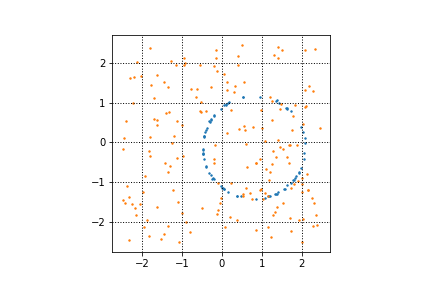
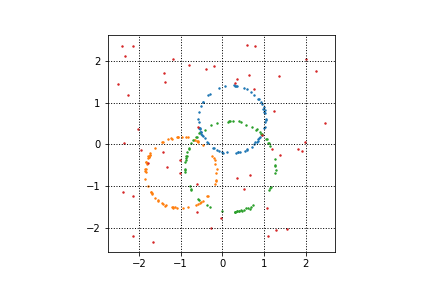
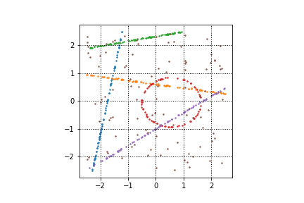

# sydraw

[](https://codecov.io/gh/WilliamBonvini/pinchsearcher)
[](https://scrutinizer-ci.com/g/WilliamBonvini/pinchsearcher)
[](https://pypi.org/project/sydraw)
[](https://pypi.org/project/sydraw)
[](https://pypistats.org/packages/sydraw)

sydraw (Synthetic Data Library) is a python library that helps you create synthetic 2D point clouds for single/multi-model single/multi-class tasks.  
You'll be able to fix a set of hyperparameters for each class of models you are interested in generating.  
Have a look at some samples:

|              Single Class - Single Model              |             Single Class -  Multi Model             |             Multi Class - Multi Model             |   
|:-----------------------------------------------------:|:---------------------------------------------------:|:-------------------------------------------------:|
|      |    |  |
                        

## Setup

### Requirements

* Python 3.8+

### Installation

Install it directly into an activated virtual environment:

```text
$ pip install sydraw
```

or add it to your [Poetry](https://poetry.eustace.io/) project:

```text
$ poetry add sydraw
```

## Usage

After installation, the package can be imported:

```text
$ python
>>> import sydraw
>>> sydraw.__version__
```

# Datasets Generation
You can generate models of circles, lines and ellipses.  
You can define a vast set of parameters to specify the sampling space and the characteristics of your models (the hyperparameters change for each model, but each of them consists in a interval of values the hyperparameter can take).  
In this README you'll find a section for each class of models in which I'll dig deeper into the hyperparameters I provide.  
the generation process is straight-forward and it is shown in the following code snippet:

```python
# import the 2D point cloud module 
from sydraw import syn2d

# optionally you can specify the sampling space of both outliers and each class by defining a dictionary (options)
# and feeding it into the set_options() function.
# for reference, this example shows you the default options:
options = {
    "outliers": {
                "x_r": (-2.5, 2.5),
                "y_r": (-2.5, 2.5)
    },
     "circles": {
               "radius_r": (0.5, 1.5),
               "x_center_r": (-1.0, 1.0),
               "y_center_r": (-1.0, 1.0),
    },

    "lines": {
                "x_r": (-2.5, 2.5),
                "y_r": (-2.5, 2.5)
    },

    "ellipses": {
                "radius_r": (0.5, 1.5),
                "x_center_r": (-1, 1),
                "y_center_r": (-1, 1),
                "width_r": (0.1, 1),
                "height_r": (0.1, 1)
    },
}

syn2d.set_options(options)


# models generation
outliers_range = [0.1,0.2,0.3,0.4,0.5]
noise_range = [0.01]
syn2d.generate_data(ns=1024,
                    npps=256,
                    class_type="circles",
                    nm=2,
                    outliers_range=outliers_range,
                    noise_range=noise_range,
                    ds_name="example_dir",
                    is_train=False                 
                    )
```

# terminology and abbreviations
- ```sample:``` unordered set of points. a sample is made by outliers and inliers for each sampled model.
- ```model:``` instance of a class (i.e. line with a specific slope and intercept)
- ```npps:``` number of points per sample
- ```ns:``` number of samples within each .mat file
- ```nm:``` number of models to be generated within each sample of the dataset

# data folder
data are saved in a structured fashion.   
here I'll show you where the data generated in the previous code snippet will be saved:
```
./data
    |- ds_name 
        |- circles
                |- nm_2
                     |- npps_256
                              |- ns_1024
                                      |- test
                                            |- imgs
                                            |- circles_no_10_noise_0.01.mat
                                            |- circles_no_20_noise_0.01.mat
                                            |- circles_no_30_noise_0.01.mat
                                            |- circles_no_40_noise_0.01.mat
                                            |- circles_no_50_noise_0.01.mat
                                              
```
where ```imgs``` contains some images of the randomly sampled models. It has the following structure:
```
imgs
   |- circles_no_10_noise_0.01
                            |- *jpg files
   |- circles_no_20_noise_0.01
                            |- *jpg files 
   |- circles_no_30_noise_0.01
                            |- *jpg files
   |- circles_no_40_noise_0.01
                            |- *jpg files 
   |- circles_no_50_noise_0.01
                            |- *jpg files
```

